# CMU_11785_Project: Financial Domain Specific Word Embeddings
## Introduction
Working with Akshat Gupta, our team’s project for 11-785 is to generate financial word
embeddings. Efficient word embeddings can improve performance on downstream tasks
by effectively modeling relationship between words in a denser vector space than simple
one hot encoding; however, a general English embedding might have spurious relationships
for financial downstream tasks. We reviewed several popular word embedding models and
evaluated their performance on the tasks in the financial domain. We then implemented
word2vec and GloVe on a subset of SEC Filings from 1994. Lastly, we tuned BERT and
BERT based architectures on a SEC Filings from 1993 - 2002. Furthermore, we performed
block coordinate descent to optimize our model and parameters for training and analyzed
different combinations of the hidden and attention layers. Through these ablation studies
we improved the accuracy on the downstream task provided by the financial phrase bank
of sentiment classification from 71% to 80% on distil BERT and we improved area under
the curve (AUC) from 0.8066 to 0.8993. This demonstrates the value of training on domain
specific knowledge, and future work could expand on hyper parameter tuning with larger
architectures

## Code
Our code is seperated broadly into the downstream task and the embedding generation.

## Figures
### Downstream Datasets
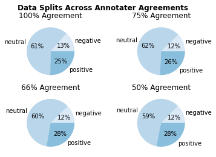
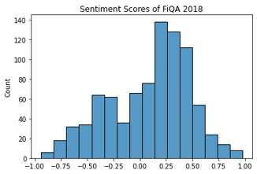

### Pipelines
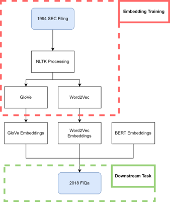
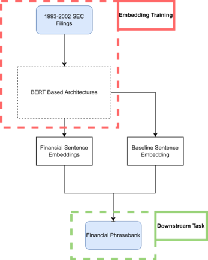

### Ablation Studies
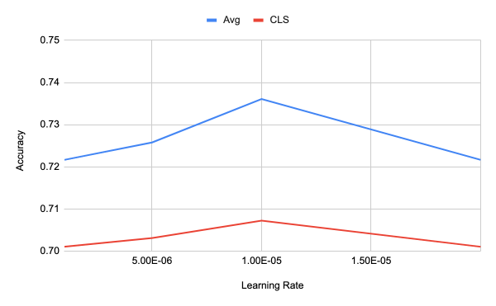
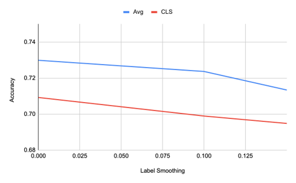
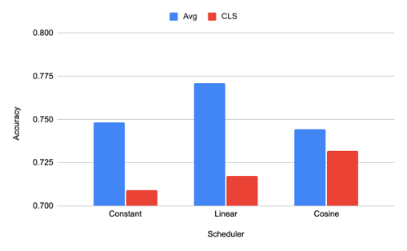
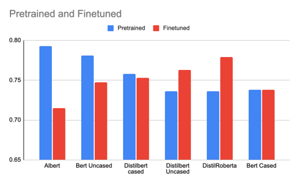
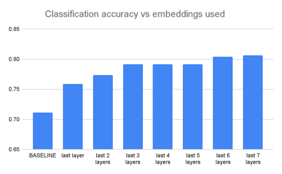

### Results
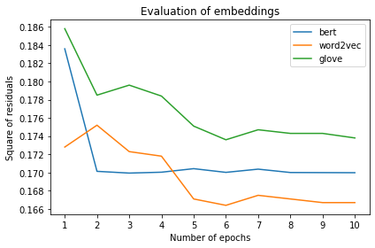
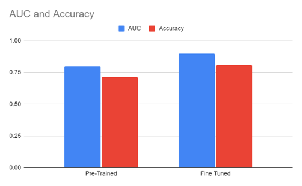
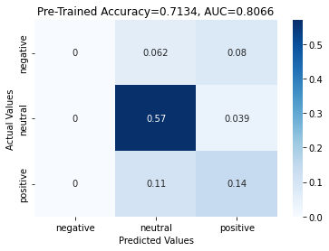
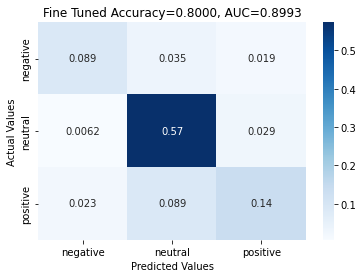
